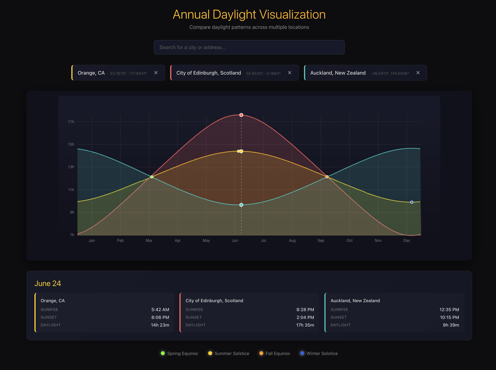

# Daylight Visualization Tool

An interactive visualization showing annual daylight patterns for any location on Earth. **Now with multi-location comparison!**





## Features

- **Multi-Location Comparison**: Overlay up to 5 locations on a single graph
- **Free Geocoding**: Search for any city or address using OpenStreetMap's Nominatim API (no API key required)
- **Interactive Canvas**: Hover over any day to see sunrise, sunset, and daylight duration for all locations
- **Color-Coded Curves**: Each location gets a unique color for easy identification
- **Astronomical Events**: Solstices and equinoxes marked on the graph
- **Smooth Gradient**: Beautiful visual representation of daylight hours throughout the year
- **Vanilla CSS**: No framework dependencies for styling
- **Pure Client-Side**: All calculations done in the browser using suncalc

## Setup

```bash

# Install dependencies
npm install

# Run dev server
npm run server
&&
npm run dev
```

The app will be available at `http://localhost:5173`

## Usage

1. **Add Locations**: Type a city name or address in the search bar (minimum 3 characters)
2. **Select from Suggestions**: Click on a suggestion to add it to the comparison
3. **Remove Locations**: Click the × button on any location chip (except if it's the only one)
4. **Hover for Details**: Move your mouse across the graph to see detailed sunrise/sunset data for all locations
5. **Compare**: See how daylight patterns differ between locations throughout the year

## Tech Stack

- **React** - UI framework
- **Vite** - Build tool and dev server
- **suncalc** - Astronomical calculations for sunrise/sunset
- **Nominatim (OpenStreetMap)** - Free geocoding API (no API key needed)
- **Canvas API** - Visualization rendering
- **Vanilla CSS** - Styling

## How It Works

The app uses the `suncalc` library to calculate precise sunrise and sunset times for each location throughout 2025. When you search for a location, it queries OpenStreetMap's Nominatim API (free, no API key required) to get coordinates. Each location is then:

1. Assigned a unique color from the palette
2. Its daylight data calculated for all 365 days
3. Rendered as an overlaid curve on the canvas
4. Shown in the hover tooltip with location-specific data

All calculations are done client-side - the only network request is the geocoding search.

## Free Geocoding Options

This app uses **Nominatim** (OpenStreetMap) which is free and requires no API key. If you want better autocomplete or higher rate limits, consider these alternatives:

- **LocationIQ**: 10,000 free requests/day with autocomplete
- **Geoapify**: 3,000 free requests/day
- **MapTiler**: Good free tier with fast responses

Simply update the geocoding fetch call in `DaylightViz.jsx` to use your preferred service.

## Future Ideas

- Year selector to compare historical patterns
- Export comparison as image
- Mobile-optimized touch interactions  
- Circular/radial visualization option
- Share comparison via URL
- Dark/light theme toggle
